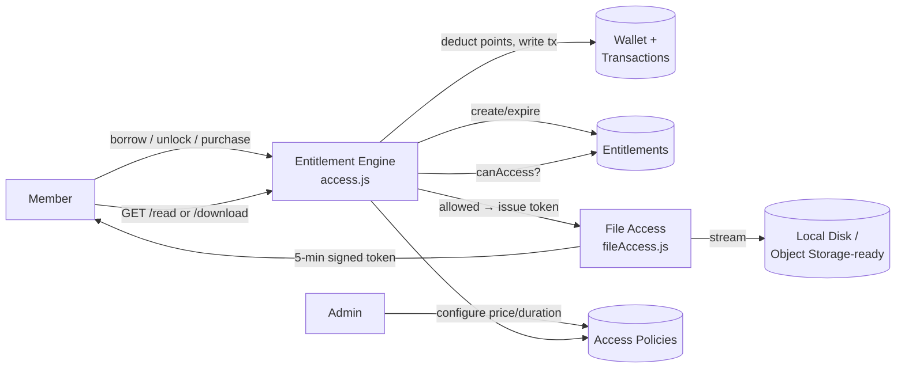

<div align="center">

# 📚 Perpusku

**A full-stack digital library & bookstore platform built around a real entitlement model — not a single `is_premium` flag.**

[](https://nodejs.org)
[](https://react.dev)
[](https://hapi.dev)
[](https://github.com/WiseLibs/better-sqlite3)
[](LICENSE)

[Overview](#overview) • [Features](#key-features) • [Architecture](#architecture) • [Getting Started](#getting-started) • [API Reference](#api-reference) • [Project Structure](#project-structure)

</div>

---

## Overview

**Perpusku** is a digital library & bookstore platform where a single book
can be **previewed for free, borrowed temporarily, unlocked for reading, or
purchased permanently** — each governed by a proper entitlement model
instead of a naive `is_premium` flag.

The project was deliberately built (and later upgraded) around one design
principle taken directly from the product spec:

> Do **not** determine access only from `book.is_premium`.
> Instead: **User → Entitlement → Book → Access Policy**

Before serving any content, the backend runs a single access-control
decision function, mirrors real-world SaaS content-licensing systems, and
demonstrates end-to-end product thinking — from use-case diagrams down to
a working, tested implementation.

> 📄 Full product spec and PlantUML design diagrams are included in
> [`docs/`](docs) — this project was built spec-first, not code-first.

---

## Key Features

- 🔐 **Entitlement-based access control** — five independent access types
  per book (`PREVIEW`, `FREE_FULL`, `BORROW`, `UNLOCK_READ`, `PURCHASE`),
  each individually priced and configured per book by an admin.
- 💰 **Points wallet economy** — top-up, spend on borrow/unlock/purchase,
  with every balance change written as an immutable transaction record.
- ⏳ **Expiring borrows** — timed access (e.g. 7 days) swept both
  dynamically on access and via a periodic background job.
- 🛡️ **Protected file delivery** — no book file is ever reachable by a
  public/guessable URL. Content is served through short-lived
  (5-minute) signed access tokens, only issued after a real entitlement
  check.
- 📖 **Online reader** with per-user reading progress tracking.
- 🗂️ **My Library** — borrowed, purchased, and unlocked books in one place.
- 🛠️ **Admin dashboard** — manage books, categories, access policies &
  pricing, and monitor every wallet transaction across all users.
- ⭐ Reviews & ratings, a blog/CMS module, and an AI reading assistant
  ("Lumina", via Groq) — carried over from the original app.
- 🌱 **Zero-friction local demo** — one `.env` flag auto-seeds a sample
  admin + member account, no email/OTP setup required to try it out.

---

## Architecture



Every read/download request is decided by a single function,
`canAccess(user, book, action)`, which mirrors the pseudocode from the
project's technical spec:

```js
function canAccess(user, book, action) {
  if (action === 'PREVIEW') return previewPolicyEnabled(book);
  if (book.freeFullEnabled) return true;
  const entitlement = findValidEntitlement(user, book);
  if (action === 'READ')     return entitlement?.canRead;
  if (action === 'DOWNLOAD') return entitlement?.canDownload;
  return false;
}
```

No route, component, or query anywhere else in the codebase is allowed to
gate content by a raw role/flag check — this function is the single source
of truth.

---

## Tech Stack

| Layer          | Choice                              | Why |
|----------------|--------------------------------------|-----|
| Frontend       | React 19 + Vite                     | Fast dev server, component model fits an interactive catalog/reader/admin UI |
| Backend        | Node.js + Hapi.js                    | Explicit route-level auth guards (`pre` handlers) fit a system with many different per-endpoint authorization rules |
| Database       | SQLite (`better-sqlite3`)            | Zero-config, single-file — anyone can clone and run this instantly with no external DB server |
| Auth           | Server-side session tokens + bcrypt  | Sessions can be revoked instantly (logout, idle timeout) — no JWT blacklist complexity needed at this scale |
| File delivery  | Local disk + short-lived signed tokens | Mirrors an object-storage signed-URL pattern; swapping in S3/GCS/R2 later only touches one file |
| AI Assistant   | Groq (OpenAI-compatible API)          | Free tier, low latency, drop-in for an explicitly out-of-scope/external subsystem |

A full write-up of *why* each choice was made is in
[`docs/tech-stack-justification.txt`](docs/tech-stack-justification.txt).

---

## Getting Started

### Backend

```bash
cd backend-perpusku
npm install
npm start          # http://127.0.0.1:5000
```

The included `.env` ships with `SEED_TEST_USERS=true`, so on first start two
ready-to-use accounts are created automatically — no email/OTP setup
required to try the app:

| Role   | Email              | Password      |
|--------|--------------------|---------------|
| Admin  | `admin@test.com`   | `password123` |
| Member | `member@test.com`  | `password123` |

To enable the real email/OTP registration flow instead, fill in
`EMAIL_PENGIRIM` / `KUNCI_EMAIL` (a Gmail address + an
[App Password](https://myaccount.google.com/apppasswords)) and set
`SEED_TEST_USERS=false`.

### Frontend

```bash
cd frontend-perpusku
npm install
npm run dev         # http://127.0.0.1:5173
```

`src/api.js` points at `http://127.0.0.1:5000` by default — update
`API_BASE` there if the backend runs elsewhere.

---

## API Reference

### Auth
| Method | Path | Notes |
|---|---|---|
| POST | `/api/register` | Sends OTP by email |
| POST | `/api/verify-otp` | Creates the account |
| POST | `/api/login` | Returns `sessionToken` |
| POST | `/api/logout` | |
| GET | `/api/session/ping` | Used for idle/auto-logout |
| POST | `/api/forgot-password` / `/api/reset-password` | |

### Books & content access
| Method | Path | Auth | Notes |
|---|---|---|---|
| GET | `/api/books` | optional | List, sanitized (no raw file path) |
| GET | `/api/books/{id}` | optional | Detail + `accessOptions` + `myAccess` |
| POST | `/api/books` | admin | Multipart upload (cover + pdf) + access policy |
| GET | `/api/books/{id}/preview` | public | Returns a short-lived stream token |
| GET | `/api/books/{id}/read` | member | `canAccess(READ)` then a stream token |
| GET | `/api/books/{id}/download` | member | `canAccess(DOWNLOAD)` then a download token |
| GET | `/api/files/stream/{token}` | — | Resolves a token issued above (5 min TTL) |
| POST | `/api/books/{id}/borrow` | member | Deducts points, creates a timed entitlement |
| POST | `/api/books/{id}/unlock` | member | Deducts points, permanent read entitlement |
| POST | `/api/books/{id}/purchase` | member | Deducts points, permanent + optional download |
| GET/PUT | `/api/books/{id}/progress` | member | Reading progress (location, %) |

### Wallet & library
| Method | Path | Notes |
|---|---|---|
| GET | `/api/wallet` | Current balance |
| GET | `/api/wallet/transactions` | Full history |
| POST | `/api/wallet/topup` | MVP stub — see [Known Limitations](#known-limitations) |
| GET | `/api/my-library` | All active entitlements |
| GET | `/api/my-library/borrowed` / `/purchased` | Filtered views |

### Admin
| Method | Path | Notes |
|---|---|---|
| GET/PUT | `/api/admin/books/{id}/access-policies` | Configure price/duration/download per access type |
| GET | `/api/admin/transactions` | All members' wallet transactions |
| POST/PUT/DELETE | `/api/blogs...` | Blog CMS |

### Misc
| Method | Path | Notes |
|---|---|---|
| GET/POST/DELETE | `/api/reviews`, `/api/favorites` | |
| POST | `/api/ask-ai` | "Lumina" assistant via Groq |

---

## Project Structure

```
perpusku/
├── backend-perpusku/         Hapi.js REST API + SQLite
│   ├── src/
│   │   ├── server.js         Routes: auth, books, wallet, entitlements, admin, AI…
│   │   ├── access.js         canAccess() engine, wallet & entitlement helpers
│   │   ├── fileAccess.js     Short-lived signed-URL-style file tokens
│   │   ├── db.js             SQLite schema (auto-created on first run)
│   │   ├── session.js        Login sessions with idle timeout
│   │   ├── seed-test-users.js  Optional sample admin/member accounts
│   │   └── migrate.js        One-off migration from the legacy database.json
│   └── uploads/               Cover images + book files (gitignored)
├── frontend-perpusku/         React + Vite SPA
│   └── src/
│       ├── api.js             Central fetch helper + typed API calls
│       └── components/        Bookshelf, BookDetail, Profile, AdminPanel, …
└── docs/
    ├── 01_project_context.txt
    ├── 02_technical_architecture.txt
    ├── tech-stack-justification.txt
    └── diagrams/               Original PlantUML use-case/activity/sequence diagrams
```

---

## Known Limitations

This is an MVP scoped deliberately (see [`docs/01_project_context.txt`](docs/01_project_context.txt) §8):

- **No real payment gateway.** `POST /api/wallet/topup` credits points
  immediately for demo purposes; in production this would be a webhook
  triggered after a payment provider confirms a charge.
- **No real object storage.** Files live on local disk; the access-token
  interface is shaped so swapping in S3/GCS/R2 later is a localized change
  to `fileAccess.js` only.
- **No true DRM.** A signed URL improves access control, but a user who is
  legitimately granted access can still copy content once it's opened.
- **Preview page limiting is client-side** (PDF.js), not enforced by
  truncating the file server-side.
- **No pagination yet** on `GET /api/books`.

---

## Design Diagrams

The PlantUML diagrams that drove this implementation are in
[`docs/diagrams`](docs/diagrams):

- `03_use_case_diagram.puml` — Member / Admin / Payment-service use cases
- `04_activity_borrow_book.puml` — Borrow flow
- `05_activity_read_book.puml` — Preview vs. entitlement-gated read flow
- `06_sequence_access_content.puml` — Protected content access sequence

Render with the [PlantUML VS Code extension](https://marketplace.visualstudio.com/items?itemName=jebbs.plantuml) or [plantuml.com](https://www.plantuml.com/plantuml).

---

## License

MIT — see [LICENSE](LICENSE).
